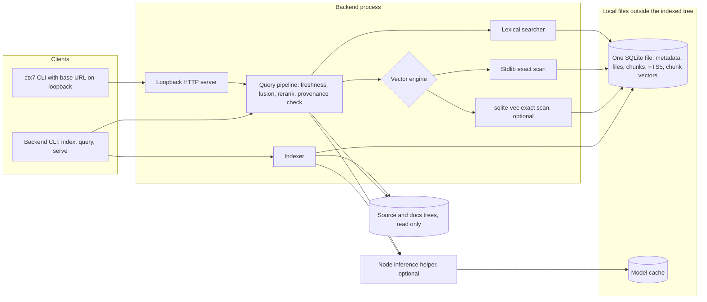
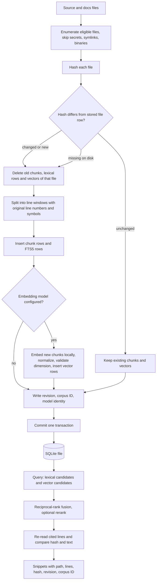
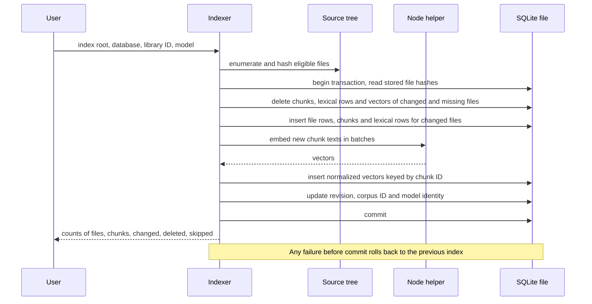
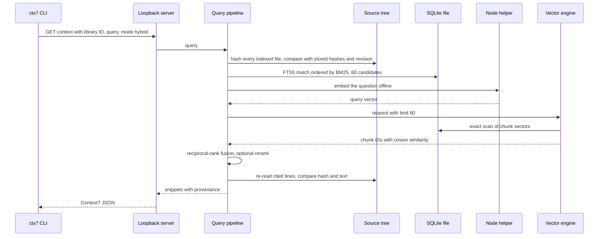
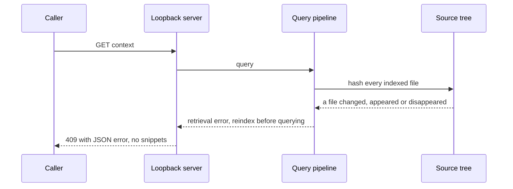

# ADR: Local code retrieval storage - Main Architecture

**Date:** 2026-10-07
**Status:** Accepted pending PR review for decisions 2 and 3. Their format-6 storage layout and focused tests are in the source branch; index format 7 adds configurable source-faithful chunking without changing that layout; platform CI and review remain pending. The comparison measurements below predate this implementation.
**PRD:** None. This ADR belongs to the optional private-retrieval workflow of the `legacy-codebase-workflows` skill: [skill entrypoint](../../skills/legacy-codebase-workflows/SKILL.md), [private retrieval reference](../../skills/legacy-codebase-workflows/references/private-retrieval.md), [backend script](../../skills/legacy-codebase-workflows/scripts/context7_backend.py).

---

## 1. Overview

The skill ships a small local backend that indexes private source code and private or generated Markdown, and answers questions through a CLI and a loopback HTTP endpoint that the Context7 CLI can call. This ADR decides where the index lives and how nearest-neighbour search over embeddings is done. It compares a single SQLite file (FTS5 plus stored embeddings scored in Python), sqlite-vec, sqliteai's sqlite-vector, and a local Chroma `PersistentClient`.

Requirements that drive the decision:

- Nothing leaves the machine. No cloud index, no remote embedding call, no telemetry. A model download is an explicit indexing step; querying and serving work offline.
- Every returned snippet carries its file, line range, file hash, repository revision and corpus ID, and a snippet whose source changed or disappeared is never returned.
- Lexical search (FTS5/BM25) always works with no install beyond Python. Semantic search, hybrid fusion and reranking are optional.
- The backend runs on Linux, macOS and Windows with Python 3.12 to 3.14, and can later be shipped as a standalone executable.
- It is a single-user local tool. It has no authentication and binds only to loopback; nothing here makes it a shared or production service.

Three things are often bundled under "vector database" and are separate here:

| Concern | What decides its quality | Decided in |
| --- | --- | --- |
| Embedding model | Whether a paraphrase lands near the right chunk | The optional Node helper and its pinned model, outside this ADR |
| Reranker | The final order of a short candidate list | The backend's lexical-symbol and optional cross-encoder rerankers, outside this ADR |
| Vector storage and search | How fast, how exactly and how safely stored vectors are compared | This ADR |

Swapping the storage engine changes latency, disk use, install size and failure modes. It cannot make retrieval more relevant: an exact engine returns the same neighbours as any other exact engine, and an approximate one returns the same or worse. Relevance changes only with the model, the chunking, the fusion or the reranker.

**Decision in one paragraph.** Keep one SQLite file as the only store: FTS5 for lexical search, provenance tables, and normalized float32 embeddings in a narrow side table. The default exact scan uses only the Python standard library. sqlite-vec 0.1.9 is the one optional query-time accelerator, scanning the same stored vectors through its scalar cosine function. Do not adopt Chroma or sqlite-vector at the current scale.

| Item | State |
| --- | --- |
| Single SQLite file with FTS5/BM25, provenance and freshness checks | Implemented |
| Normalized float32 BLOB embeddings, exact `math.sumprod` scan (`stdlib` engine) | Implemented since index version 4; moved to `chunk_vectors` in version 6 |
| Optional sqlite-vec 0.1.9 scalar cosine scan | Implemented in version 6; query-time selection over the same vectors |
| Reciprocal-rank fusion and reranking in application code | Implemented |
| Embeddings in a `chunk_vectors` side table | Implemented in version 6 (decision 2) |
| sqlite-vec as a query-time capability over the side table, no `vec0` copy | Implemented in version 6 (decision 3) |
| Chroma, sqlite-vector, Qdrant, NumPy, any approximate index | Rejected at current limits (decisions 4 to 6) |

---

## 2. Technology Documentation References

The three Context7 IDs were supplied as verified by the coordinating brief. The statements in this ADR were checked on 2026-10-06 against the official repositories, documentation and PyPI metadata at the versions below.

| Library | Context7 ID or official docs | Used for |
|---|---|---|
| SQLite FTS5 (SQLite 3.46.1 tested) | https://www.sqlite.org/fts5.html | Lexical index and BM25 ranking |
| Python `sqlite3` | https://docs.python.org/3/library/sqlite3.html | Database access; `enable_load_extension` is only present when Python was built with loadable-extension support |
| Python `math.sumprod` (3.12+) | https://docs.python.org/3/library/math.html#math.sumprod | Dependency-free dot product for the default scan |
| sqlite-vec 0.1.9 (2026-03-31), MIT or Apache-2.0 | `/asg017/sqlite-vec` ; https://github.com/asg017/sqlite-vec | Optional exact distance functions and `vec0` KNN in C |
| sqlite-vector 1.1.2 (2026-09-11), Apache-2.0 | `/sqliteai/sqlite-vector` ; https://github.com/sqliteai/sqlite-vector | Compared, not adopted: SIMD full scan and quantized scan |
| Chroma 1.5.9 (2026-05-05), Apache-2.0 | `/chroma-core/chroma` ; https://docs.trychroma.com | Compared, not adopted: local `PersistentClient` with HNSW |
| qdrant-client 1.19.1, Apache-2.0 | https://github.com/qdrant/qdrant-client | Considered, not probed |
| Transformers.js 3.8.1 | https://huggingface.co/docs/transformers.js | Optional local embedding and reranker inference in the Node helper |
| Context7 CLI (`ctx7` 0.5.13 tested) | https://github.com/upstash/context7 | Unmodified client pointed at the loopback endpoint with `--base-url` |

Naming trap: "sqlite-vec" is Alex Garcia's extension (`asg017/sqlite-vec`, PyPI `sqlite-vec`, module `sqlite_vec`). "sqlite-vector" in this ADR is SQLite AI's different extension (`sqliteai/sqlite-vector`, PyPI `sqliteai-vector`, module `sqlite_vector`). The PyPI name `sqlite-vector` is an abandoned 2023 alpha of an earlier asg017 project and is neither of them.

---

## 3. System Architecture

### Architecture pattern

A local command-line program with three commands (`index`, `query`, `serve`) over one SQLite database file per indexed corpus. `serve` is a single-process loopback HTTP server. Embedding and cross-encoder inference run in a short-lived Node subprocess. There is no daemon, no second datastore and no network dependency at query time.

### Repository structure

- `skills/legacy-codebase-workflows/scripts/context7_backend.py`: indexing, freshness, lexical, semantic, fusion, reranking, CLI and HTTP server.
- `skills/legacy-codebase-workflows/scripts/repo_files.py`: safe file enumeration and reading shared with the repository map.
- `skills/legacy-codebase-workflows/scripts/retrieval/`: the optional Node inference helpers and their pinned manifest and lockfile.
- `skills/legacy-codebase-workflows/scripts/requirements-retrieval.txt`: the optional pinned `sqlite-vec` package.
- `tests/test_legacy_retrieval.py`: backend tests.
- The database, model cache and inference runtime are created by the user outside every indexed directory. The backend refuses to index when any of them is inside an indexed root.

### Technology stack

| Layer | Technology | Reason |
|---|---|---|
| System of record | One SQLite file | Chunks, lexical index, provenance and embeddings commit or roll back together |
| Lexical search | SQLite FTS5 with BM25 | Ships inside Python's `sqlite3`; exact identifiers matter most in code |
| Default vector search | Exact scan with `math.sumprod` over float32 BLOBs | No install, no native code, same result on every platform |
| Optional vector search | sqlite-vec 0.1.9 distance functions | 0.2 MB, no dependencies, exact, 7 to 19 times faster than the stdlib scan at 30,000 chunks |
| Fusion and reranking | Python in the backend | Independent of the storage engine, so engines stay interchangeable |
| Embeddings | Transformers.js in a Node subprocess, pinned model revision | Optional; already chosen by the retrieval workflow |
| Client contract | Context7 REST routes on loopback | Lets the stock `ctx7` CLI read a private index |

---

## 4. Module Structure & Dependencies

| Module | Responsible for | Depends on | Used by |
|---|---|---|---|
| Corpus scanner | Enumerating eligible code and Markdown, skipping secrets, symlinks, binaries and oversized files; hashing | Filesystem, optional `git` | Indexer, freshness guard |
| Chunker | Fixed line windows with original line numbers and extracted symbols | Corpus scanner | Indexer |
| Store | Schema, transactions, metadata, FTS5 rows, chunk rows, embedding rows | `sqlite3` | Indexer, searchers, freshness guard |
| Embedding client | Turning text into unit vectors through the Node helper, offline unless indexing | Node runtime, local model cache | Indexer, semantic searcher |
| Vector engine | `nearest(query vector, limit)` over stored embeddings; two interchangeable implementations | Store; optionally the sqlite-vec extension | Semantic searcher |
| Lexical searcher | BM25 candidates with a symbol bonus | Store | Query pipeline |
| Query pipeline | Freshness check, candidate generation, reciprocal-rank fusion, optional reranking, provenance re-verification | Lexical searcher, vector engine, embedding client, store | CLI, HTTP server |
| HTTP server | Context7-compatible routes on loopback | Query pipeline | `ctx7` CLI or any local HTTP caller |

Dependencies point one way: interfaces -> query pipeline -> searchers -> store. The vector engine never reads source files, never calls the embedding client and never writes. Fusion and reranking never know which engine produced the semantic candidates.

---

## 5. Data Models

All entities live in the one SQLite file and last until the next `index` run changes them.

**Index metadata.** Key and value text pairs: indexed root, optional docs root, library ID, repository revision, corpus ID (a hash over the revision and every file hash), index format version, embedding model ID and immutable revision, vector dimension when a model is configured, optional reranker ID and revision, model cache and runtime locations. The saved vector engine is a query preference, not a storage format; changing it alone does not rebuild embeddings.

**Chunking version.** Index format 7 stores `chunk_chars` (default 1,200; supported 128 to 12,000), preserves whole original lines with at most 48 lines and eight overlap lines, and reports indivisible oversized lines. Changing this setting rebuilds chunks and vectors; changing only the engine preference does not. The character target is not a tokenizer budget, and optional embedding inference rejects an input over its 12,000 UTF-16-unit helper limit before scoring. Historical vector-storage benchmark figures below retain their original format labels.

**File.** Kind (`code`, `repo-docs` or `docs`), relative path, SHA-256 of the content, size. Primary key is kind plus path. One file has many chunks.

**Chunk.** Integer ID, kind, path, first and last original line, the exact text of those lines, extracted symbol names. The embedding is stored separately.

**Lexical row.** An FTS5 row keyed by the chunk ID with the chunk text, symbols and path. Created and deleted with its chunk.

**Embedding.** A `chunk_vectors` row: the chunk ID as primary key with a cascading foreign key to the chunk, and the embedding as little-endian float32 values, normalized to unit length before writing. Its byte length must equal four times the recorded dimension. Every chunk has one embedding when a model is configured; a corpus indexed without a model has none.

**Accelerator.** There is no persistent accelerator table. sqlite-vec is loaded only for semantic or hybrid requests that select it and scores `chunk_vectors.embedding` through `vec_distance_cosine`.

Invariants the store must hold after every committed `index` run: every lexical row and every embedding belongs to an existing chunk; every chunk belongs to an existing file row whose hash matched the source at index time; all embeddings share one dimension and one model revision.

---

## 6. API / Interface Contracts

### `index` command

- Input: repository root; database path; library ID in `/owner/name` form; optional docs root; `--chunk-chars 128..12000`; optional embedding model with model cache and inference runtime paths; optional model revision; optional reranker model and revision; `--vector-engine stdlib|sqlite-vec` as the saved query preference.
- Output: JSON with library ID, revision, corpus ID, counts of files, chunks, changed and deleted files, and skipped files with reasons.
- Errors: database, cache or runtime inside an indexed root; database belongs to another corpus; more than 10,000 files or 30,000 chunks; embedding helper failure; a custom model without an immutable revision. Any error leaves the previous committed index untouched.
- Notes: the only command allowed to download model files. A change of model, model revision, chunk target or index format rebuilds everything. Changing only the engine preference leaves vectors unchanged. An old index with `vec0` needs the pinned extension once to drop its virtual table during reindexing; if the package is unavailable, use a fresh database path.

### `query` command

- Input: database path; question of 1 to 500 characters; mode `lexical`, `semantic` or `hybrid`; optional reranker; result limit 1 to 10; optional `--vector-engine stdlib|sqlite-vec|auto`. Omission uses the saved preference.
- Output: JSON with library ID, mode, reranker, selected `vectorEngine` (`null` for lexical), corpus ID and results. Each result has kind, path, start and end line, file SHA-256, revision, corpus ID, the snippet text and a score. An empty result carries an explicit "no matching indexed evidence" message.
- Errors: unindexed or outdated-format database; semantic or hybrid mode on an index without embeddings; any source file changed, appeared or disappeared since indexing; local model files missing.
- Notes: never downloads. A stale index is an error, never a partial answer.

### `serve` command

- `GET /api/v2/libs/search` with `libraryName`: returns the one local library when the name matches, otherwise an empty list.
- `GET /api/v2/context` with `libraryId` and `query`, optional `type=txt`, and for direct callers `mode`, `rerank`, `limit` and `vectorEngine`: returns Context7-shaped code and info snippets whose titles and descriptions carry the full provenance string. `serve --default-vector-engine` sets the default for requests without `vectorEngine`.
- Errors: 404 for an unknown library or route, 409 with a JSON error for every retrieval error including a stale index, 413 for a request line over 2,048 characters.
- Notes: loopback addresses only, no authentication, no rate limit.

### Vector engine (internal boundary)

- `nearest`: input is a unit-length query vector and a candidate limit of at most 60; output is chunk IDs with cosine similarity, best first, ties broken by lower chunk ID. Both engines must return the same IDs in the same order for the same index, apart from ties within float32 rounding.
- `available`: the stdlib engine is always available. The sqlite-vec engine is available only when the Python build allows loading extensions, the pinned package imports, and the loaded extension reports version 0.1.9.
- Writes are not part of the engine. Embeddings are inserted, replaced and deleted by the indexer inside the same transaction as their chunk.
- Selection rule: omitted query engine uses the saved `index --vector-engine` preference (default `stdlib`); explicit `auto` uses sqlite-vec when the adapter loads, then falls back to stdlib only when the adapter is unavailable. Explicit `sqlite-vec` fails if unavailable or at the wrong version. A wrong version also fails under `auto` instead of silently falling back.

---

## 7. Environment Variables

Storage introduces no environment variable. The engine, paths and models are command-line options or index metadata, so an index describes itself.

| Variable | Purpose | Required | Example value |
|---|---|---|---|
| `PATH` | Read by the backend to find `node` and `git`; the only inherited variable passed to the inference helper | Yes for semantic search and for Git-aware file listing | System default |
| `HOME` | Set by the backend for the helper subprocess to the model cache directory so nothing is written to the user profile | Set internally | Model cache path |
| `HF_HUB_OFFLINE` | Set by the backend for the helper: `0` only while `index` downloads a model, `1` for every query | Set internally | `1` |
| `LEGACY_RETRIEVAL_TEST_RUNTIME` | Tests only: inference runtime directory that enables the real-model tests | No | Directory containing `node_modules` |
| `LEGACY_RETRIEVAL_TEST_CACHE` | Tests only: model cache used with the variable above | No | Model cache directory |
| `LEGACY_CTX7_CLI` | Tests only: path to an installed `ctx7` entry script for the client contract test | No | Path to the CLI script |

No credential is read, stored or forwarded. The helper receives none of the caller's other variables.

---

## 8. Technical Decisions

### Evidence used by these decisions

A local probe indexed the same deterministic corpus into every candidate and compared each top 10 with exact float64 cosine. Corpus: 1,000 to 30,000 chunks (30,000 is the backend's chunk limit) of 384-dimensional clustered unit vectors, each with a 48-line code-like text and provenance, and 30 queries. Build and query ran in separate processes. Environment: Python 3.14.4, SQLite 3.46.1, x86-64 Linux under WSL2, AMD EPYC 7763 with 7 logical CPUs, while other jobs were running on the machine. The backend rows ran the backend's own `semantic()` from a pinned copy at index version 4; its schema and vector code are unchanged in version 5.

| Storage and scoring | State | Median ms, 10,000 | Median ms, 30,000 | Vector MB, 30,000 | Recall@10 | Install MB |
|---|---|---:|---:|---:|---:|---:|
| JSON text in `chunks`, Python loop | Superseded (index <= 3) | 1,937 | 5,748 | 245.8 | 1.000 | 0 |
| float32 BLOB in `chunks`, `math.sumprod` | Implemented default | 175 | 520 | 122.9 | 1.000 | 0 |
| float32 BLOB in side table, `math.sumprod` | Proposed default | 95 | 342 | 61.6 | 1.000 | 0 |
| Side table, NumPy, matrix reloaded per query | Rejected | 60 | 179 | 61.6 | 1.000 | 68.6 |
| sqlite-vec `vec0` plus BLOB copy in `chunks` | Implemented optional | 8.4 | 27.0 | 170.8 | 1.000 | 0.2 |
| sqlite-vec `vec0` only | Alternative | 8.9 | 35.7 | 48.5 | 1.000 | 0.2 |
| Side table, sqlite-vec `vec_distance_cosine` | Proposed optional | 16.8 | 47.5 | 61.6 | 1.000 | 0.2 |
| BLOB in `chunks`, sqlite-vec `vec_distance_cosine` | Reference | 42.6 | 116.9 | 122.9 | 1.000 | 0.2 |
| sqlite-vector full scan (side table) | Rejected | 11.7 | 34.5 | 73.4 | 1.000 | 0.3 |
| sqlite-vector quantized scan | Rejected | 1.7 | 6.1 | 73.4 | 0.977 / 0.973 | 0.3 |
| Chroma `PersistentClient`, HNSW, vectors only | Rejected | 2.5 | 1.9 | 61.5 | 1.000 | 419.7 |

Other measurements from the same run:

- A fresh Python process takes 15 ms to start, 25 ms including loading sqlite-vec, 116 ms to import NumPy, 862 ms to import `chromadb`, and 1,067 ms to import Chroma, open a 10,000-vector collection and answer one query.
- Peak memory of the query process at 30,000 chunks: 32 to 40 MB for the SQLite candidates, 56 MB for sqlite-vector, 144 MB with NumPy, 182 to 191 MB with Chroma.
- Storage time for 30,000 chunks, excluding embedding inference: 4.2 s for FTS5 alone, 5.0 s with the then-proposed side table, 8.3 s with the format-4 inline BLOB, 10.3 s with the format-4 sqlite-vec engine, 21.8 s for a Chroma vector sidecar on top of the SQLite index, 88.7 s when Chroma also stores documents and provenance.
- FTS5/BM25 lexical queries took a median of 25 ms at 10,000 chunks and 64 ms at 30,000 on this synthetic text. A hybrid query with 60 candidates per ranking took 571 ms with the format-4 default, 91 ms with the format-4 sqlite-vec engine and 104 ms with the then-proposed sqlite-vec layout.
- Chroma 1.5.9 local raised `NotImplementedError: Search is not implemented for Local Chroma` for its Search API with RRF. Its `where_document` `$contains` filter worked locally and matched a substring count exactly; it filters, it does not rank.
- Chroma ran correctly inside an empty network namespace with `embedding_function=None`, so the local client needs no network.
- sqlite-vec `vec0` and the side table both took part in SQLite transactions: a delete was visible inside the transaction and a rollback restored the vector.
- sqlite-vector's quantized scan returned a deleted row and missed a newly inserted row until `vector_quantize` was run again. Its full scan saw both changes immediately.

Limits of this evidence: it is a microbenchmark on one machine and one operating system, with synthetic vectors and text. It supports claims about exactness, storage cost and scan cost. It says nothing about which model or engine retrieves better answers, and the timings are per query inside an already running process. In the real backend each semantic query also starts the embedding helper, which took 0.5 to 1.4 s in the retrieval workflow's own evaluation, and re-hashes every indexed file for the freshness check. Those two costs were not measured here and are larger than every vector scan below 50 ms.

### 1. One SQLite file is the only store

**Status:** Accepted (implemented; matches the approved skill design)
**Date:** 2026-10-07
**Context:** Results must cite the exact file, lines, hash and revision, and a stale or deleted source must never be returned. Lexical search has to work with nothing installed.
**Decision:** Keep chunks, the FTS5 index, provenance, metadata and embeddings in one SQLite database written in one transaction per `index` run. Every other structure is derived from it and rebuildable.
**Rejected alternatives:**
- A vector database as the primary store: none of the candidates provides BM25 ranking locally, so SQLite FTS5 would still be needed and there would be two stores to keep consistent.
- Flat files (JSON lines plus a NumPy array): no transactional replace of one file's chunks, and FTS would have to be reimplemented.
**Consequences:**
- (+) A failed or interrupted indexing run leaves the previous index intact, including its embeddings.
- (+) Lexical-only use needs Python 3.12 and nothing else.
- (-) One writer at a time; concurrent indexing of the same database is not supported.
**Review trigger:** A requirement for several simultaneous writers, or for an index shared between machines.

### 2. Default vector search is an exact stdlib scan over float32 BLOBs in a side table

**Status:** Accepted pending PR review. Implemented in index format 6; focused storage tests pass locally.
**Date:** 2026-10-07
**Context:** The assumption going in was that scoring vectors in Python would be the bottleneck near 30,000 chunks. Measured, the JSON loop of index versions up to 3 was: 5.7 s per query. The version 4 change to packed float32 and `math.sumprod` cut that to 0.52 s, with identical results. What remains is partly layout: an embedding stored in the wide `chunks` row costs 4.1 KB per chunk instead of 2.1 KB and forces every scan to read past the chunk text.
**Decision:** Keep the exact stdlib scan as the default engine and move embeddings to a `chunk_vectors` side table with a cascading foreign key. Normalize on write, validate dimension and finiteness on write, and score with a dot product. At the 30,000-chunk limit this measured 342 ms instead of 520 ms and 61.6 MB instead of 122.9 MB.
**Rejected alternatives:**
- Keep the embedding in the `chunks` row: worked in formats 4 and 5, but doubles vector disk use and slows both engines (sqlite-vec's distance function took 117 ms inline against 47.5 ms on the side table).
- NumPy matrix: 179 ms when the matrix is rebuilt per query, which is what a CLI process does, for a 68.6 MB dependency and a 116 ms import. It only wins inside a long-running server that caches the matrix (1 ms), and that cache would need its own invalidation.
- Keep JSON text: 11 times slower and twice the disk of the format-4 default, with no benefit.
**Consequences:**
- (+) Semantic search works on every supported platform and inside a standalone executable with no native add-on.
- (+) Exact results, so the engine can never be the reason a relevant chunk is missed.
- (-) Scan time grows linearly: about 95 ms at 10,000 chunks and 342 ms at 30,000 on the test machine.
- (-) The layout change needs an index format bump, which forces a one-time reindex including re-embedding.
**Review trigger:** The chunk limit is raised above 30,000, or the stdlib scan exceeds 500 ms at the limit on a supported platform.

### 3. sqlite-vec is the only optional accelerator, used as a query-time capability

**Status:** Accepted pending PR review. Implemented in index format 6; focused native-extension tests pass locally.
**Date:** 2026-10-07
**Context:** Index format 5 built a `vec0` virtual table next to the BLOB stored in `chunks`. It was fast (27 ms at 30,000) and transactional, but stored every vector twice (170.8 MB against 61.6 MB), fixed the engine when the index was built, and loaded the extension on every connection, so even a lexical query failed on a machine without sqlite-vec.
**Decision:** Treat sqlite-vec as a faster way to scan the same `chunk_vectors` table, using its cosine distance function in an ordered, limited query. Keep `index --vector-engine` as a saved default for compatibility; explicit `query --vector-engine` and `serve --default-vector-engine` override it. `auto` is opt-in and falls back only if the adapter is unavailable. Explicit `sqlite-vec` and a wrong installed version fail clearly. Load the extension only for selected semantic and hybrid queries. Pin 0.1.9 exactly and check its reported version.
**Rejected alternatives:**
- Keep `vec0` plus the BLOB copy (format 5): 27 ms instead of 47.5 ms at 30,000, at the cost of 2.8 times the vector disk, a second structure to keep in step with deletions, and an index that cannot be queried without the extension. Both figures are far below the embedding helper's start-up time, so the difference is not visible to a user.
- `vec0` as the only vector store: smallest on disk (48.5 MB) and as fast, but the index becomes unreadable without the extension and its shadow-table format belongs to a project that states it is pre-v1 and may make breaking changes. A raw float32 BLOB has no such dependency.
- sqlite-vec approximate indexes (IVF, DiskANN): present only in 0.1.10 alpha releases, not in a stable release, and unnecessary below the review trigger.
**Consequences:**
- (+) One copy of each vector; deletion and replacement are one cascading statement in the chunk's own transaction.
- (+) An index built with or without sqlite-vec is the same file. It can be copied to a machine without the extension and still answers, more slowly.
- (+) 0.2 MB install, no dependencies, wheels for Linux x86-64 and arm64, macOS x86-64 and arm64, and Windows x86-64.
- (-) About 20 ms slower per query at 30,000 chunks than the current `vec0` engine.
- (-) Loading needs a Python built with loadable SQLite extensions. The Python documentation notes this is not the default build option and names macOS; there is no wheel for musl Linux or Windows on Arm. The stdlib engine covers those cases.
**Review trigger:** A stable sqlite-vec release ships an approximate index and the chunk limit must exceed about 100,000, where the exact distance-function scan is projected (linearly, not measured) to pass 150 ms; or sqlite-vec reaches 1.0 with a stable `vec0` format, which removes the main objection to `vec0` as the single store.

### 4. Chroma local is not adopted

**Status:** Proposed
**Date:** 2026-10-07
**Context:** Chroma's `PersistentClient` is a real local option: a Rust core with an HNSW index, Apache-2.0, wheels for the same five platforms, no telemetry since 1.5.4, and it ran here on Python 3.14 without network access. It had the fastest warm query (about 2 ms at every size) and recall of 1.000 on this corpus.
**Decision:** Do not use Chroma as the default or as an optional engine at the current scale.
**Rejected alternatives:**
- Chroma as the only store: its local full-text feature is a substring and regex filter without BM25 ranking, so SQLite FTS5 is still required.
- Chroma as a vector sidecar next to SQLite: measured and workable, but it is a second store with its own commit. A crash between the two commits leaves vectors for deleted chunks or chunks without vectors, so the indexer would need a reconciliation pass that the single-file design does not.
- Chroma's Search API for hybrid RRF: available in Chroma Cloud only. The local client raised `NotImplementedError`, and the documentation says single-node support is planned. Fusion would stay in the backend either way.
**Consequences:**
- (+) Install stays at 0 to 0.2 MB instead of 419.7 MB (80 installed packages, among them `onnxruntime`, `kubernetes` and `grpcio`), which also keeps a standalone executable small.
- (+) No 0.86 s import on every CLI query. At 10,000 vectors a cold Chroma query took 1,067 ms end to end; a fresh process using sqlite-vec needs about 42 ms for the same work (25 ms to start and load the extension plus a 17 ms scan, measured separately).
- (+) Query memory stays near 35 MB instead of about 185 MB.
- (-) No approximate index, so vector search time grows linearly with the corpus.
**Review trigger:** A single corpus needs more than about 250,000 chunks in a long-running server where the import cost is paid once; and local Chroma offers hybrid search; and the two-store consistency cost is accepted.

### 5. sqlite-vector (SQLite AI) is not adopted

**Status:** Proposed
**Date:** 2026-10-07
**Context:** sqlite-vector works on ordinary tables like the selected side table, has SIMD kernels, and its quantized scan was the fastest SQLite option (6.1 ms at 30,000, 2.0 ms preloaded).
**Decision:** Do not adopt it now.
**Rejected alternatives:**
- Its exact full scan: 34.5 ms at 30,000, within noise of sqlite-vec, so it adds a second native dependency without a gain.
- Its quantized scan: recall fell to 0.973, and the quantized data went stale on every insert and delete until `vector_quantize` was re-run, which conflicts directly with the freshness requirement unless every index update re-quantizes.
**Consequences:**
- (+) One optional native dependency to pin, test and document instead of two.
- (-) No quantized, memory-bounded scan for very large corpora.
- Licence note: the project was under the Elastic License 2.0 until 2026-09-10 and is Apache-2.0 from release 1.1.2. Anyone pinning it must pin 1.1.2 or later and re-read the licence of the exact version.
**Review trigger:** A corpus on the order of a million chunks on memory-constrained hardware, with an indexer that re-quantizes in the same run as every change.

### 6. No approximate index and no further vector stores at the current limits

**Status:** Proposed
**Date:** 2026-10-07
**Context:** The backend caps an index at 10,000 files and 30,000 chunks and returns at most 10 results from at most 60 candidates per ranking.
**Decision:** Exact search only. Qdrant was considered and not probed: the client's embedded local mode is documented as intended for development, prototyping and testing, the real engine is a separate server, and it would repeat the second-store problem of decision 4.
**Rejected alternatives:**
- HNSW or another approximate index: saves at most tens of milliseconds at this size and introduces a recall parameter that has to be tested and explained.
- A server-based vector database: contradicts the no-daemon, single-file design.
**Consequences:**
- (+) Engines are interchangeable and testable by exact equality of results.
- (-) Corpora beyond the chunk limit must be indexed as separate subtrees.
**Review trigger:** The chunk limit is raised above 100,000, or the measured p95 of the vector step with sqlite-vec exceeds 200 ms on a supported platform.

### 7. Hybrid fusion and reranking stay in application code

**Status:** Accepted (implemented)
**Date:** 2026-10-07
**Context:** Hybrid search needs a lexical ranking and a semantic ranking combined. None of the local candidates fuses BM25 with vector results.
**Decision:** Fuse the two candidate lists with reciprocal-rank fusion (constant 60) in the backend, then apply the optional lexical-symbol or cross-encoder reranker to at most 60 candidates. The vector engine only supplies an ordered candidate list.
**Rejected alternatives:**
- Engine-side fusion: unavailable locally (decision 4) and would tie result order to one engine.
- Weighted score blending: BM25 scores and cosine similarities are on unrelated scales; rank fusion needs no calibration.
**Consequences:**
- (+) Changing the engine cannot change the fused order when both engines are exact.
- (-) Fusion quality depends on candidate depth, which is fixed and small.
**Review trigger:** A held-out evaluation on real repositories shows relevant chunks regularly ranked below the 60-candidate cut in either list.

### 8. Embedding identity is index metadata, and a model change rebuilds the index

**Status:** Accepted (implemented)
**Date:** 2026-10-07
**Context:** Vectors from different models or revisions are not comparable, and a mixed index fails silently.
**Decision:** Record the model ID, immutable model revision and dimension in the index. Reject a stored vector whose length does not match. Rebuild all embeddings when the model, its revision or the index format changes. Query vectors are produced by the same model, offline.
**Rejected alternatives:**
- Per-row model tags with mixed models in one index: more bookkeeping and no use case at this scale.
- Letting the store compute embeddings (as Chroma does by default): would hide a model download inside the storage layer, against the explicit-download rule.
**Consequences:**
- (+) An index cannot return neighbours computed across two models.
- (-) Changing the model costs a full re-embedding run.
**Review trigger:** Indexing time for a full re-embed becomes a practical obstacle to trying a second model.

---

## 9. Diagrams

### 9.1 Architecture / Component Diagram



### 9.2 Data Flow Diagram



### 9.3 Sequence Diagrams

#### Incremental index of a changed and a deleted file



#### Hybrid query through the Context7 CLI



#### Source changed after indexing



#### Optional engine not available (explicit auto selection)

```mermaid
sequenceDiagram
  participant P as Query pipeline
  participant E as Vector engine selector
  participant X as sqlite-vec extension
  participant D as SQLite file
  P->>E: nearest, engine auto
  E->>X: load extension and read version
  alt loads and reports the pinned version
    E->>D: ordered distance-function scan of chunk vectors
  else not installed or extension loading disabled
    E->>D: stdlib scan of the same chunk vectors
  end
  E-->>P: same chunk IDs in the same order
  Note over P,E: Wrong version fails; explicit sqlite-vec also fails when unavailable
```

---

## 10. Testing Strategy

### Philosophy

Because every accepted engine is exact, the main oracle is equality: both engines must return the same chunk IDs in the same order as a brute-force cosine computed in the test. Freshness and transaction behaviour are tested against real SQLite files and, for the optional engine, the real native extension. Adapter unavailability is simulated separately. Model-dependent tests stay opt-in behind the existing test variables so the default suite needs no download. Performance is checked with the probe, not asserted in CI, because shared runners make timing gates unreliable.

### Test layers

| Layer | Type | Scope | Tools |
|---|---|---|---|
| Unit | Deterministic, no model | Vector packing and validation, normalization, engine equality on synthetic vectors, tie-breaking, fusion order | `unittest`, synthetic float32 vectors |
| Integration | Real SQLite, real sqlite-vec when installed | Index, reindex, delete, rollback, engine selection and fallback, stale-source errors, schema invariants | `unittest`, temporary directories, pinned `sqlite-vec` |
| Integration, opt-in | Real model through the Node helper | Semantic, hybrid and reranked queries on the held-out fixture, offline query after an indexed download | `LEGACY_RETRIEVAL_TEST_RUNTIME`, `LEGACY_RETRIEVAL_TEST_CACHE` |
| Contract, opt-in | Unmodified `ctx7` against the loopback server | Library lookup and context routes, empty result, 409 on stale index | `LEGACY_CTX7_CLI` |
| Benchmark, manual | Storage probe | Scan time, disk size and exactness at 1,000 to 30,000 chunks | The storage probe kept with the research notes |

### Key test scenarios

- **Engines agree.** Index a corpus with embeddings, query with the stdlib engine and with sqlite-vec. Expected: identical chunk IDs and order, scores equal within 1e-5. Edge cases: one chunk, a limit larger than the corpus, duplicate vectors (order falls back to chunk ID).
- **Brute-force oracle.** For synthetic unit vectors with a fixed seed, compare each engine's top 10 with cosine computed directly in the test. Expected: equal sets for every query.
- **Changed file.** Modify one indexed file and reindex. Expected: no chunk, lexical row or vector with the old content remains; the vector count equals the chunk count; a query that matched only the old text returns nothing.
- **Deleted file.** Remove a file and reindex. Expected: its chunks, lexical rows and vectors are gone and it can no longer appear in lexical, semantic or hybrid results.
- **Failed indexing run.** Make the embedding helper fail halfway. Expected: the database still answers with the previous index and its metadata is unchanged.
- **Stale query.** Change a source file without reindexing. Expected: `query` exits with an error and the server returns 409; no snippet is returned in any mode.
- **Invalid vectors.** Offer a zero vector, a non-finite value and a vector of the wrong dimension. Expected: indexing fails with a clear error and commits nothing; a stored vector of the wrong length is rejected at query time.
- **Model change.** Reindex with a different model revision. Expected: every vector is rebuilt and none from the old revision remains.
- **Engine unavailable.** Hide the sqlite-vec package, and separately simulate a Python without extension loading. Expected: `auto` falls back to the stdlib scan with identical results; an explicit `sqlite-vec` request fails with a message naming the pinned package; lexical queries succeed in both cases.
- **Wrong extension version.** Load a stub reporting another version. Expected: a clear version error, including under explicit `auto`.
- **No embeddings.** Index without a model. Expected: lexical works, semantic and hybrid return the documented error, and no vector rows exist.
- **Offline query.** After indexing, run semantic queries with the network blocked. Expected: success, and no attempt to download.
- **Portability of the file.** Build an index where sqlite-vec is installed and query it where it is not. Expected: same results.

### Technical acceptance criteria

- TAC-01: After every committed `index` run, the number of embedding rows equals the number of chunks when a model is configured and is zero otherwise, and no lexical row or embedding row references a missing chunk.
- TAC-02: For a fixed-seed corpus of at least 1,000 synthetic 384-dimensional unit vectors and 30 queries, the stdlib engine and the sqlite-vec engine each return a top 10 identical to brute-force float64 cosine for every query.
- TAC-03: Reindexing after modifying or deleting a file leaves zero rows of any kind for the removed content, verified by direct counts on chunks, lexical rows and embeddings.
- TAC-04: An indexing run that fails after writing some rows leaves the database's corpus ID and row counts identical to their values before the run.
- TAC-05: With any indexed file changed, added or removed, `query` exits non-zero and `/api/v2/context` returns 409 in all three modes, with no snippet in the body.
- TAC-06: With sqlite-vec absent, the full default test suite passes and semantic queries return the same top 10 as with it present on the same index file.
- TAC-07: A lexical query on an index that has embeddings succeeds on an interpreter where loading SQLite extensions is impossible.
- TAC-08: Every stored embedding has a byte length of exactly four times the recorded dimension and a Euclidean norm within 1e-3 of 1.
- TAC-09: `query` and `serve` complete semantic and hybrid requests with network access blocked, and the only code path that sets the helper to online mode is `index`.
- TAC-10: Portable retrieval checks pass on Linux, macOS and Windows with Python 3.12, 3.13 and 3.14; lexical retrieval and default vector scoring require only the standard library. Optional inference/native-adapter tests report unavailable capabilities as skipped. At least one extension-capable CI lane per operating system requires the actual sqlite-vec tests to pass, using `LEGACY_REQUIRE_SQLITE_VEC=1`; a missing required capability fails that lane.
- TAC-11: On the storage probe's 30,000-chunk corpus on comparable hardware, the proposed layout measures at or below 700 ms median for the stdlib scan, at or below 100 ms median for the sqlite-vec scan, and at or below 2.2 KB of embedding storage per chunk.
- TAC-12: The skill installs and answers lexical queries with zero third-party Python packages, and the only optional Python package for retrieval is `sqlite-vec` pinned to 0.1.9.

**Verification at acceptance.** Local focused tests exercised format-6 migration and rollback, unchanged vector bytes after a preference switch, foreign-key deletion, a fixed-seed 1,000-by-384 vector oracle with 30 queries against the actual sqlite-vec 0.1.9 extension, ties, empty and single-row scans, no-package override and `auto` fallback. The storage probe measured the proposed narrow side-table layouts before this implementation; its version-4 backend comparison remains labeled as such. The coordinator subsequently ran all 38 format-7 retrieval tests with real local embeddings, cross-encoder scoring, sqlite-vec and the stock Context7 0.5.13 client; none were skipped. Another 24 mapper checks passed separately with their parser dependencies. Runtime-capability tests distinguish missing SQLite extension support from a broken installed adapter and verify explicit stdlib/auto fallback; Windows inference retains only essential OS startup paths. This covers the local HTTP and model checks for TAC-05 and TAC-09. TAC-10 still requires platform CI. The local sandbox disallowed socket creation during the first HTTP test attempt, which is an environment restriction rather than a passing contract result.
